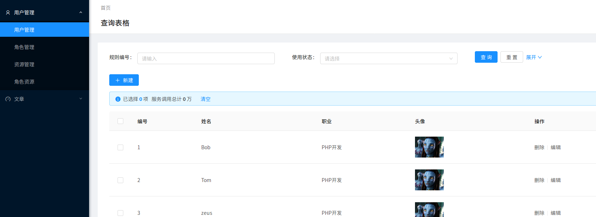

## Overview
ISOPHP社区网站正在建设中，欢迎提交PR，共同建设社区。

## Prerequisites

```
# Install PHP,Nodejs,Nginx,Mysql
# Install composer
php -r "copy('https://getcomposer.org/installer', 'composer-setup.php');"
php -r "if (hash_file('SHA384', 'composer-setup.php') === '544e09ee996cdf60ece3804abc52599c22b1f40f4323403c44d44fdfdd586475ca9813a858088ffbc1f233e9b180f061') { echo 'Installer verified'; } else { echo 'Installer corrupt'; unlink('composer-setup.php'); } echo PHP_EOL;"
php composer-setup.php
```

## Quick Start
```
git clone https://github.com/isophp/isophp.git
cd isophp && composer install
cd isophp/ManagerPlatform && npm install
npm start
# optional
echo '127.0.0.1 devel.isophp.cn' |sudo tee -a /etc/hosts
```

### 推荐开发环境
- PHP v7.2 or later
- Mysql v5.7 or later
- Nodejs v8.9.4 or later
- Nginx v1.13.8 or later
- Redis v4.0.6 or later

### 技术栈

- [Phalcon3.3.1](https://github.com/phalcon/cphalcon/releases)
- [Ant Design pro](https://pro.ant.design/index-cn)
- [UIkit](https://getuikit.com)

##### 代码结构
```
isophp/
├── Apps
    ├── Article 
        ├── ArticleInfo.php                      ----------------------- Apps/Bar/Foo.php 封装models接口,向外提供增删查改接口
        ├── Handler
        │   ├── ArticleHandler.php               ----------------------- Apps/Bar/Handler/FooHandler.php 后台接口
        │   └── CategoryHandler.php
        └── Models                               ----------------------- models相关
            └── Content.php
         
isophp/Modules/     
├── Article                                      ----------------------- 独立模块
│   ├── Controllers                              ----------------------- Controllers
│   │   └── IndexController.php
│   ├── Module.php
│   └── Router.php                               ----------------------- 路由注册
├── BaseModule.php


```

1. 所有的model都放在 Apps/分类/Models/下
2. Apps/分类/*.php里对应的就是Repository概念，是对该栏目下models的封装
3. 所有的处理后台的接口都放在Apps/分类/Handler/×Handler.php（下面的ant design Apps下面的每个model都和一个Handler一一对应）
4. 所有网站前端页面，接口都在Modules/分类/Controller/*Controller.php
5. *Hanlder.php   *Controller.php里操作model都调用Repository概念的类（Apps/分类/*.php）
6. 路由注册都在 Modules/分类/Router.php  

##### 前端页面路由 
- 打开页面 devel.isophp.cn
  - 找到在Site模块中注册的路由'/'
  - controller action对应于Site/Controlelrs/IndexController.php->indexAction()。
  - 这个index渲染视图是Views/pages/index/index.volt
- 打开devel.isophp.cn/test 返回的是json，前端接口的开发可以参考这个，这个例子路由注册在Sys模块里

##### 后台前端代码结构（基于Ant Design pro）
- 后台代码位于ManagerPlatform
- 项目结构基本参考[AntDesignPro文档](https://pro.ant.design/docs/getting-started-cn#%E7%9B%AE%E5%BD%95%E7%BB%93%E6%9E%84)，只是对models目录进行了调整，所有的model都放在 ManagerPlatform/src/Apps下，和 PHP 的结构保持一致，对应的php接口在Apps/下。
- 后台接口统一走 deve.isophp.cn/adminApiGate(在Sys模块下注册)，所有处理后台请求的接口都放在Apps/*/Handler/*Handler.php
- 例如后台想要调用Apps/User/Handler/UserHandler.php->listAction()
参数：
```json
{
  "module": "User",
  "handler": "User",
  "method": "list",
  "payload": {
    "page":1,
    "pageSize":10
  }
}
```
- 举例（部署好环境后可看到）： 
用户列表管理后台（例子里封装了获得当前用户和用户列表的例子）
  
1. 后台的栏目和路由注册和ant design pro保持一直还是在src/common/下面，具体参考ant design pro文档
2. ant design pro中用户管理的model是src/Apps/User/User.js
3. 对应的php接口都放在 用Apps/User/Handler/UserHandler.php里

##### 前端页面选型
TODO

##### PHP 脚本

脚本放在Console下面，已经封装好了一个TestTask.php想要执行它的mainAction：
```shell
cd Console
php cli.php test main 我是参数1 我是参数2
```

##### PHP 测试
测试目录在Tests下，在项目根目录下执行测试
```shell
phpunit
```
Tests目录下有几个测试的例子，可以参考来做。
ps: 单元测试没有问题，接口测试unit会报错错误（Test code or tested code did not (only) close its own output buffers
这是phalcon会提前输出cookie和header），但是不影响测试，后面会去想办法兼容。

##### 前端测试
TODO

##### api接口异常封装
在Framework/Exceptions下面定义了几种Api异常，api接口可以使用。
例如： Modules/Sys/Controllers/IndexController.php->unauthorizedAction()中的使用

##### log
1. 对异常进行了捕获，错误会输出到Logs/System-date('Y-m-d').log
2. 业务开发中如果需要记录日志可以使用 Log::getLogger('日志名')->日志类型(msg)

#### nginx参考配置
```nginx
server {
    listen      80;
    server_name devel.isophp.cn;
    root       /ISOPHP/PROJECT/PATH/public; 
    index       index.php index.html index.htm;
    charset     utf-8;
    access_log /NGINX/LOG/PATH/isophp.log accesslog;

    location / {
        try_files $uri $uri/ /index.php?$query_string;
    }

    location ~ \.php$ {
        try_files     $uri =404;

        fastcgi_pass  127.0.0.1:9000;
        fastcgi_index /index.php;

        include fastcgi_params;
        fastcgi_split_path_info       ^(.+\.php)(/.+)$;
        fastcgi_param PATH_INFO       $fastcgi_path_info;
        fastcgi_param PATH_TRANSLATED $document_root$fastcgi_path_info;
        fastcgi_param SCRIPT_FILENAME $document_root$fastcgi_script_name;
    }

    location ~ /\.ht {
        deny all;
    }
}

```
