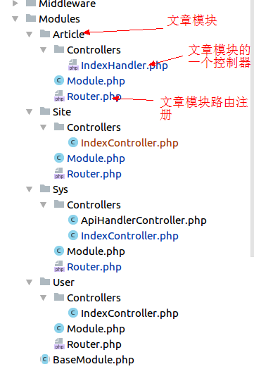

## 项目介绍
本项目为ISOPHP社区网站源码，以开源的方式进行开发，任何感兴趣的人都可以参与进来，共同建设社区。
### 项目使用到的技术
PHP7.2、phalcon72、nginx、mysql5.7、ant design pro、node8.0、npm 5.6
### 项目初期版本
先做了一个简单的结构整理，项目的各个细节还需要进一步完善，作为一个起点，前期大家熟悉下项目结构，调整项目的结构，
形成最终版本后进行具体的业务开发。  
#### 项目结构设计
因为开源的方式多人开发，项目结构理念是每个模块在结构上是独立的，这样减少多人开发不同模块造成冲突的可能。
##### 后台代码结构
1. 所有的model都放在 Apps/分类/Models/下
2. Apps/分类/*.php里对应的就是Repository概念，是对该栏目下models的封装
3. 所有的处理后台的接口都放在Apps/分类/Handler/×Handler.php（下面的ant design Apps下面的每个model都和一个Handler一一对应）
4. 所有网站前端页面，接口都在Modules/分类/Controller/*Controller.php
5. *Hanlder.php ×Controller.php里操作model都调用Repository概念的类（Apps/分类/×.php）
6. 路由注册都在 Modules/分类/Router.php  

##### 网站前端页面路由结构
前端页面路由（指网站页面）结构使用了phalcon的多模块的概念。<br/>
  
图中的Article模块，Router.php是注册本模块的的路由，Controllers里是具体的Controller 
举例(等下面配置好环境后)：  
1. 打开的 devel.isophp.cn页面就是在Site模块中注册的路由‘/’，controller action对应于
Site/Controlelrs/IndexController.php->indexAction()。这个index渲染视图是Views/pages/index/index.volt
2. 打开devel.isophp.cn/test 返回的是json，前端接口的开发可以参考这个，这个例子路由注册在Sys模块里

##### ant design pro后台前端代码结构介绍
后台前端代码放在ManagerPlatform里  
项目结构基本跟ant design pro保持一直，只是对models目录进行了调整，所有的model都放在 ManagerPlatform/src/Apps下，和 PHP 的结构保持一致，对应的php接口在Apps/下。
这样放的目的也是为了把各个模块的代码控制在一个文件下，利于多人开发，减少冲突。  
同时把后台接口统一走 deve.isophp.cn/adminApiGate(在Sys模块下注册)，所有处理后台请求的接口都放在Apps/*/Handler/*Handler.php
例如后台想要调用Apps/User/Handler/UserHandler.php->listAction()
参数：
```json
{
  "module": "User",
  "handler": "User",
  "method": "list",
  "payload": {
    "page":1,
    "pageSize":10
  }
}
```
举例（部署好环境后可看到）： 
用户列表管理后台（例子里封装了获得当前用户和用户列表的例子）
  
1. 后台的栏目和路由注册和ant design pro保持一直还是在src/common/下面，具体参考ant design pro文档
2. ant design pro中用户管理的model是src/Apps/User/User.js
3. 对应的php接口都放在 用Apps/User/Handler/UserHandler.php里

##### 前端页面选型
待定

##### PHP 脚本

脚本放在Console下面，已经封装好了一个TestTask.php想要执行它的mainAction：
```shell
cd Console
php cli.php test main 我是参数1 我是参数2
```

##### PHP 测试
测试目录在Tests下，在项目根目录下执行测试
```shell
phpunit
```
Tests目录下有几个测试的例子，可以参考来做。
ps: 单元测试没有问题，接口测试unit会报错错误（Test code or tested code did not (only) close its own output buffers
这是phalcon会提前输出cookie和header），但是不影响测试，后面会去想办法兼容。

##### 前端测试
待定

##### api接口异常封装
在Framework/Exceptions下面定义了几种Api异常，api接口可以使用。
例如： Modules/Sys/Controllers/IndexController.php->unauthorizedAction()中的使用

##### log
1. 对异常进行了捕获，错误会输出到Logs/System-date('Y-m-d').log
2. 业务开发中如果需要记录日志可以使用 Log::getLogger('日志名')->日志类型(msg)

### 项目开发流程

#### 开发约定
1. 默认开发环境使用 devel.isophp.cn域名
2. 缩进4个空格
3. Config目录下有一个config.dev.php这里可以配置开发环境变量用以覆盖config.php里的配置

#### 项目部署
1. clone项目到本地
2. cd isophp && composer install
3. 添加nginx配置(见下面)
4. 配置hosts,添加 127.0.0.1 devel.isophp.cn // 到此可以打开devel.isophp.cn查看项目前端页面
5. 执行 cd isophp/ManagerPlatform && npm install
6. 执行 npm start 即可打开基于ant design pro的后端管理页面

##### nginx配置
```nginx
server {
    listen      80;
    server_name devel.isophp.cn;
    root       /你的isophp项目路径/public; 
    index       index.php index.html index.htm;
    charset     utf-8;
    access_log /你的nginx log目录/isophp.log accesslog;

    location / {
        try_files $uri $uri/ /index.php?$query_string;
    }

    location ~ \.php$ {
        try_files     $uri =404;

        fastcgi_pass  127.0.0.1:9000;
        fastcgi_index /index.php;

        include fastcgi_params;
        fastcgi_split_path_info       ^(.+\.php)(/.+)$;
        fastcgi_param PATH_INFO       $fastcgi_path_info;
        fastcgi_param PATH_TRANSLATED $document_root$fastcgi_path_info;
        fastcgi_param SCRIPT_FILENAME $document_root$fastcgi_script_name;
    }

    location ~ /\.ht {
        deny all;
    }
}

```